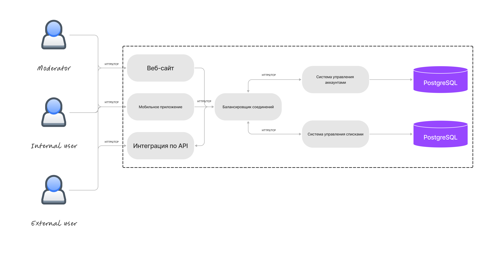
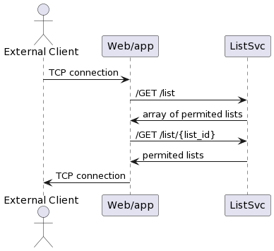
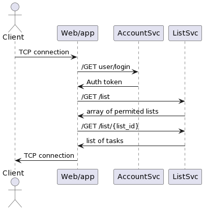
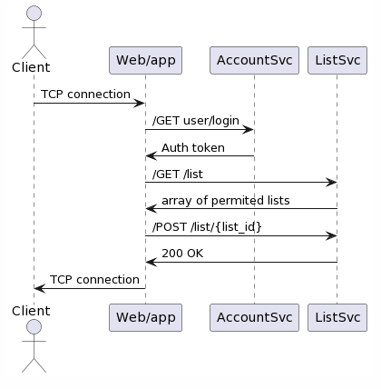
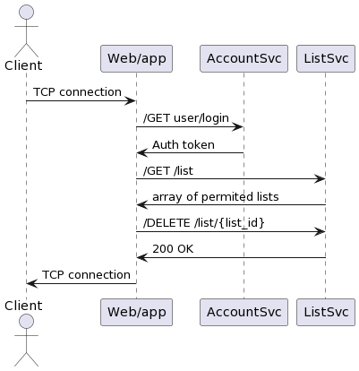

### Общая схема взаимодействия сервисов

Ассинзронность обеспечивается балансировщиком запросов и установления соединения через TCP.

### Пользовательские сценарии

#### UC1. Получение списка задач для неавторизованного пользвателя

#### UC2. Получение списка задач для авторизованного пользвателя

#### UC3. Добавление и изменение списка задач для авторизованного пользвателя

#### UC4. Удаление списка задач для авторизованного пользвателя

ps: мне хватит единички, спасибо

